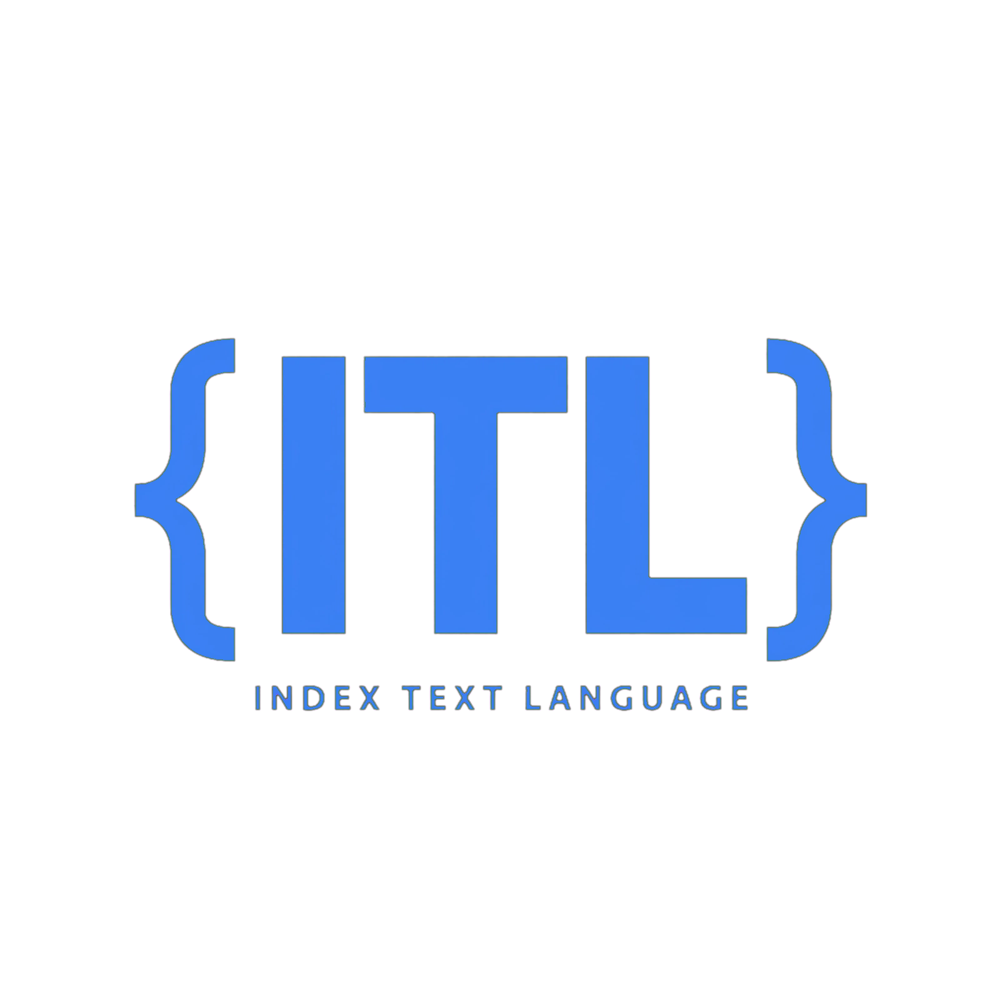

# {ITL} - Index Text Language


**ITL is a pure Tools-based programming language created by BlueBixt.**

No operators like `==`, `+`, `=`. Everything is a Tool: `xxx{}`.

---

## Why ITL?

Other languages use symbols: `if (a == b) { }`

ITL uses only Tools:
```itl
If{IsEqual{a,b}}
  Print{Equal}
EndIf{}
```

- **Pure:** Only `ToolName{}` syntax
- **Readable:** English-like Tools
- **Simple:** No symbols to memorize
- **Blue:** Signature color #3B82F6

---

## Installation

### From Source
```bash
git clone https://github.com/BlueBixt/index-text-language.git
cd index-text-language
```

### Requirements
- Any text editor (VS Code recommended)
- ITL extension (coming soon)

---

## Quick Start

Create `hello.itl`:
```itl
Print{Hello, World!}
```

Create `var.itl`:
```itl
Var{name: Rogge}
Print{Hello {name}}
```

Create `logic.itl`:
```itl
Var{a: 10}
Var{b: 10}
If{IsEqual{a,b}}
  Print{a equals b}
Else{}
  Print{Not equal}
EndIf{}
```

Create `loop.itl`:
```itl
For{i From 1 To 5}
  Print{Count is {i}}
EndFor{}
```

---

## Language Specification v1.4.0

| Property | Value |
|----------|-------|
| Extension | `.itl` |
| Color | `#3B82F6` |
| Language ID | `10890` |
| Organization | BlueBixt |
| Grammar Scope | `source.itl` |
| Paradigm | Tools-based |
| License | MIT |

### Core Tools

#### I/O
- `Print{content}` - Output text
- `Input{varName}` - Get user input

#### Variables
- `Var{name: value}` - Declare variable
- `List{name: [a,b,c]}` - List
- `Dict{name: {k:v}}` - Dictionary

#### Logic
- `If{condition}` - Conditional
- `Else{}` - Else branch
- `EndIf{}` - End if
- `IsEqual{a,b}` - Equality check
- `IsGreater{a,b}` - Greater than

#### Loops
- `For{i From x To y}` - For loop
- `EndFor{}` - End loop
- `While{condition}` - While loop
- `EndWhile{}`

#### Functions
- `Func{name}` - Define function
- `EndFunc{}` - End function
- `Call{name}` - Call function
- `Return{value}` - Return value

---

## Syntax Highlighting

ITL highlighting is provided by:

- `syntax/itl.tmLanguage.json` - In this repo
- `vendor/grammars/ITL/itl.tmLanguage.json` - For GitHub Linguist

Color: **Blue #3B82F6**

---

## GitHub Linguist

This language is pending addition to GitHub Linguist.

- PR: `github/linguist` - ITL Addition
- Sample: `samples/ITL/sample.itl`
- Grammar: `vendor/grammars/ITL/itl.tmLanguage.json`

Once merged, all `.itl` files on GitHub will show as ITL with blue color.

---

## Contributing

Contributions welcome!

1. Fork this repo
2. Create branch `feature/YourTool`
3. Add your `.itl` example in `examples/`
4. Submit PR

Please follow pure Tools syntax - no operators.

---

## License

MIT License - See LICENSE

Copyright (c) 2025 BlueBixt - Rogge Ramos

---

## About BlueBixt

BlueBixt is a tech org from Baguio City, Philippines.

- GitHub: @BlueBixt
- Language: ITL v1.4.0
- Creator: Rogge Ramos

**Made with Blue #3B82F6 in Baguio City, PH**

---

### Star this repo if you like ITL!
